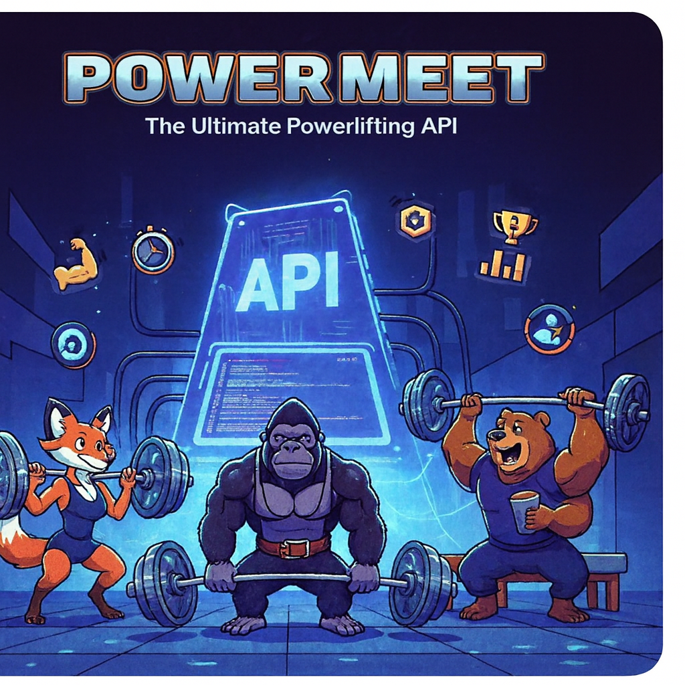

---
# markdownlint-disable
# vale  off
layout: default
nav_order: 1
# tags used by AI files
description: Describes PowerMeet for a new user
tags: 
    - introduction
categories: 
    - tutorial
ai_relevance: high
importance: 9
prerequisites: []
related_pages: 
    - /before-you-start-a-tutorial 
    - /tutorials/add-a-new-gym
    - /tutorials/add-a-new-lifter
examples: []
api_endpoints: []
version: "v1.0"
last_updated: "2025-10-07"
# vale  on
# markdownlint-enable
---

# PowerMeet API

This is a mock API to simulate the REST interface of an
imaginary service.

PowerMeet helps powerlifters find other lifters, powerlifting-friendly gyms, and local competitions.
This API has two resources: lifters and gyms.
You can query the system to see information about a specific lifter or a gym.
You can also see the list of all lifters or all gyms, along with available information.
This way, lifters know right away if a gym has the equipment they need.

## Quickstart

[Add your first gym _(coming soon)_](#quickstart) to see how easy it is.

## Tutorials

Learn how to do common tasks.

First, complete this tutorial to set up your development system for these tutorials.
You only have to do this one time per development system.

* [Before you start a tutorial](before-you-start-a-tutorial.md)

After your system is ready, these tutorials show you how to perform common tasks.

* [Add a new lifter](tutorials/add-a-new-lifter.md)
* [Add a new gym](tutorials/add-a-new-gym.md)

## API reference docs

Detailed descriptions of the service's resources.

The API reference docs refer to a `{base_url}` when they
refer to the URL of a resource. The `{base_url}` value depends
on the installation of the service.

When run locally for testing, the `{base_url}` is
generally `http://localhost:3000`.

* [The lifter resource](api/lifter.md)
* [The gym resource](api/gym.md)
