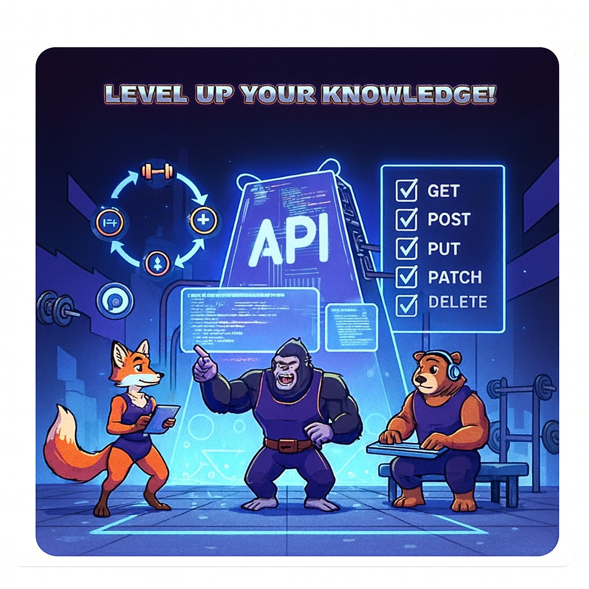

---
# markdownlint-disable
# vale  off
layout: default
nav_order: 5
has_children: true
has_toc: false
# tags used by AI files
description: Lists the tutorials available in the documentation
tags: 
    - introduction
categories:
    - tutorial
ai_relevance: high
importance: 8
prerequisites: []
related_pages: 
    - /tutorials/add-a-new-gym
    - /tutorials/add-a-new-lifter
examples: []
api_endpoints: []
version: "v1.0"
last_updated: "2025-11-07"
# vale  on
# markdownlint-enable
---

# Tutorials

These tutorials are available to help you start using the **PowerMeet API**.

Be sure to review [Before you start a tutorial](before-you-start-a-tutorial.md)
before you start trying out the tutorials.

* [Get a list of all lifters](tutorials/get-all-lifters.md)
* [Get a lifter by ID](tutorials/get-a-lifter-by-id.md)
* [Add a new lifter](tutorials/add-a-new-lifter.md)
* [Add a new gym](tutorials/add-a-new-gym.md)
